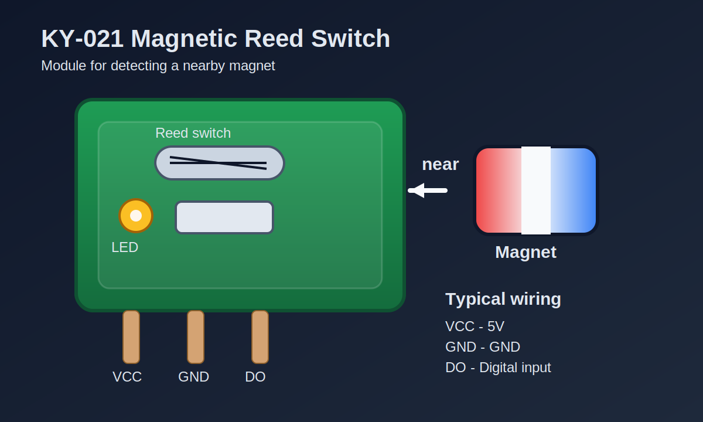

# KY-021 Magnetic Reed Switch Module

## 1. ภาพรวม

KY-021 เป็นโมดูล **Magnetic Reed Switch** หรือสวิตช์แม่เหล็กแบบรีดสวิตช์ ใช้ตรวจจับการมีอยู่ของสนามแม่เหล็กใกล้ตัวเซ็นเซอร์

เมื่อมีแม่เหล็กเข้าใกล้ หลอดรีดสวิตช์ภายในจะปิดวงจร ทำให้ขาเอาต์พุตเปลี่ยนสถานะ เหมาะสำหรับงานตรวจจับเปิด-ปิดประตู หน้าต่าง หรือชิ้นงานที่มีแม่เหล็กติดอยู่

## 2. รูปประกอบ



## 3. สเปกหลัก

> หมายเหตุ: โมดูล KY-021 ที่มีขายตามท้องตลาดอาจมีรายละเอียดปลีกย่อยต่างกันเล็กน้อย แต่ค่าด้านล่างคือค่าที่พบได้บ่อยสำหรับโมดูลชนิดนี้

| รายการ | ค่าโดยประมาณ |
|---|---|
| ประเภทเซ็นเซอร์ | Magnetic Reed Switch |
| แรงดันเลี้ยง | 3.3V ถึง 5V |
| เอาต์พุต | Digital ON/OFF |
| สถานะปกติ | เปิดวงจร หรือปิดวงจรตามรุ่น/การต่อวงจรบนบอร์ด |
| ระยะตรวจจับ | ขึ้นกับกำลังแม่เหล็กและตำแหน่งติดตั้ง |
| การใช้งาน | ตรวจจับประตู, หน้าต่าง, ฝาครอบ, ตำแหน่งวัตถุ |

## 4. หลักการทำงาน

ภายใน KY-021 มีหลอดรีดสวิตช์ที่ประกอบด้วยแผ่นโลหะบาง 2 ชิ้นบรรจุอยู่ในหลอดแก้ว

เมื่อไม่มีแม่เหล็ก:

- หน้าสัมผัสภายในยังไม่แตะกัน
- สัญญาณเอาต์พุตจะอยู่ในสถานะหนึ่งตามวงจรบนบอร์ด

เมื่อมีแม่เหล็กเข้าใกล้:

- สนามแม่เหล็กทำให้หน้าสัมผัสภายในดูดเข้าหากัน
- เอาต์พุตจะเปลี่ยนสถานะทันที

สรุปคือ KY-021 เป็นเซ็นเซอร์แบบ **ดิจิทัล** ไม่ได้ให้ค่า Analog ต่อเนื่อง

## 5. ขาเชื่อมต่อ

โดยทั่วไปบอร์ดจะมี 3 ขา

| ขา | ชื่อ | หน้าที่ |
|---|---|---|
| 1 | VCC | ไฟเลี้ยง 3.3V - 5V |
| 2 | GND | กราวด์ |
| 3 | DO | ขา Digital Output |

## 6. การต่อใช้งานกับ Arduino UNO

### ตัวอย่างการต่อ

| KY-021 | Arduino UNO |
|---|---|
| VCC | 5V |
| GND | GND |
| DO | D2 |

### แผนผังการต่อแบบย่อ

```text
KY-021            Arduino UNO
------            -----------
VCC   --------->  5V
GND   --------->  GND
DO    --------->  D2
```

## 7. ตัวอย่างโค้ด Arduino

```cpp
const int reedPin = 2;
const int ledPin = 13;

void setup() {
  pinMode(reedPin, INPUT_PULLUP);
  pinMode(ledPin, OUTPUT);
  Serial.begin(9600);
}

void loop() {
  int state = digitalRead(reedPin);

  if (state == LOW) {
    digitalWrite(ledPin, HIGH);
    Serial.println("Magnet detected");
  } else {
    digitalWrite(ledPin, LOW);
    Serial.println("No magnet");
  }

  delay(200);
}
```

## 8. การใช้งานที่เหมาะสม

- ตรวจจับการเปิด-ปิดประตู
- ตรวจจับฝาตู้หรือฝาครอบ
- นับรอบการหมุนเมื่อใช้แม่เหล็กติดกับชิ้นส่วนที่เคลื่อนที่
- งาน alarm หรือ security แบบง่าย

## 9. ข้อควรระวัง

- ระยะตรวจจับขึ้นอยู่กับขนาดและความแรงของแม่เหล็ก
- อย่าให้หลอดแก้วของ reed switch กระแทกแรง
- ถ้าขา DO มีอาการสั่นค่า ควรทำ debounce ในซอฟต์แวร์
- การวางแนวของแม่เหล็กมีผลต่อการทำงานมาก

## 10. สรุป

KY-021 เป็นโมดูลเซ็นเซอร์แม่เหล็กแบบง่าย ใช้ไฟเลี้ยงน้อย ต่อกับไมโครคอนโทรลเลอร์ได้สะดวก และเหมาะกับงานตรวจจับสถานะเปิด-ปิดที่ไม่ซับซ้อน

