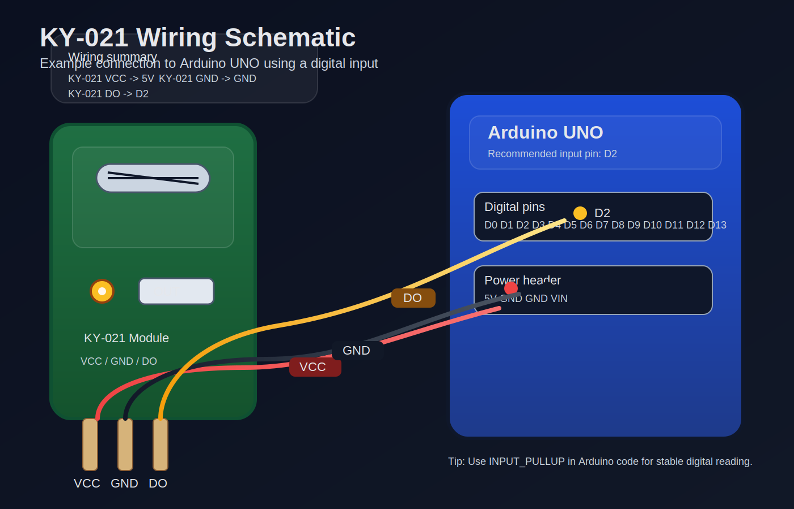

# ออกแบบวิธีการทดสอบ Sensor ให้แสดงผลที่ Serial Monitor

## 1. วัตถุประสงค์

1. ทดสอบการทำงานของเซ็นเซอร์ KY-021 แบบ Reed Switch
2. อ่านสถานะจากขา Digital ของเซ็นเซอร์ด้วย Arduino UNO
3. แสดงผลสถานะของเซ็นเซอร์บน Serial Monitor
4. ตรวจสอบว่ามีแม่เหล็กเข้าใกล้หรือไม่จากข้อความที่พิมพ์ออกมา

---

## 2. หลักการทำงาน

KY-021 เป็นเซ็นเซอร์แบบดิจิทัล เมื่อมีแม่เหล็กเข้าใกล้ Reed Switch ภายในโมดูลจะเปลี่ยนสถานะทางไฟฟ้า ทำให้ Arduino อ่านค่าได้จากขา `DO`

แนวทางการอ่านค่าสำหรับงานทดลองนี้คือ:

- ใช้ขา `D2` ของ Arduino UNO เป็นขาอินพุต
- ตั้งค่าเป็น `INPUT_PULLUP`
- อ่านค่าด้วย `digitalRead()`
- ถ้าพบสถานะ `LOW` ให้แสดงว่า "Magnet detected"
- ถ้าพบสถานะ `HIGH` ให้แสดงว่า "No magnet"

---

## 3. อุปกรณ์ที่ใช้

| รายการ | จำนวน |
|---|---|
| Arduino UNO | 1 |
| KY-021 Reed Switch Module | 1 |
| สาย Jumper | 3 เส้น |
| แม่เหล็ก | 1 ชิ้น |
| คอมพิวเตอร์ที่เปิด Serial Monitor ได้ | 1 |

---

## 4. วงจรการต่อใช้งาน

### 4.1 ภาพวงจร schematic



### 4.2 ตารางการต่อสาย

| KY-021 | Arduino UNO | หมายเหตุ |
|---|---|---|
| VCC | 5V | จ่ายไฟให้โมดูล |
| GND | GND | กราวด์ร่วม |
| DO | D2 | ขาอ่านค่าสัญญาณ |

### 4.3 ผังการต่อแบบข้อความ

```text
KY-021            Arduino UNO
------            -----------
VCC   --------->  5V
GND   --------->  GND
DO    --------->  D2
```

---

## 5. ขั้นตอนการทดสอบ

### 5.1 เตรียมอุปกรณ์

1. ต่อวงจร KY-021 เข้ากับ Arduino UNO ตามตารางด้านบน
2. เชื่อม Arduino UNO กับคอมพิวเตอร์ผ่านสาย USB
3. เปิด Arduino IDE หรือ PlatformIO ที่รองรับ Serial Monitor

### 5.2 อัปโหลดโปรแกรม

ใช้โค้ดตัวอย่างด้านล่างแล้วอัปโหลดลงบอร์ด

```cpp
const int reedPin = 2;
const int ledPin = 13;

void setup() {
  pinMode(reedPin, INPUT_PULLUP);
  pinMode(ledPin, OUTPUT);
  Serial.begin(9600);
  Serial.println("KY-021 test started");
}

void loop() {
  int state = digitalRead(reedPin);

  if (state == LOW) {
    digitalWrite(ledPin, HIGH);
    Serial.println("Magnet detected");
  } else {
    digitalWrite(ledPin, LOW);
    Serial.println("No magnet");
  }

  delay(200);
}
```

### 5.3 เปิด Serial Monitor

1. เปิด Serial Monitor ใน Arduino IDE
2. ตั้งค่า Baud Rate เป็น `9600`
3. ตรวจสอบว่าข้อความเริ่มแสดงผลต่อเนื่อง

### 5.4 ทดสอบด้วยแม่เหล็ก

1. นำแม่เหล็กเข้าใกล้ตัวเซ็นเซอร์
2. สังเกตข้อความที่แสดงใน Serial Monitor
3. เอาแม่เหล็กออก แล้วดูการเปลี่ยนสถานะอีกครั้ง
4. ทดลองขยับระยะห่างเพื่อดูจุดที่เซ็นเซอร์เริ่มตอบสนอง

---

## 6. ผลที่คาดว่าจะได้

เมื่อไม่มีแม่เหล็กเข้าใกล้:

- LED บนขา 13 ดับ
- Serial Monitor แสดงข้อความ `No magnet`

เมื่อมีแม่เหล็กเข้าใกล้:

- LED บนขา 13 ติด
- Serial Monitor แสดงข้อความ `Magnet detected`

ตัวอย่างผลลัพธ์บน Serial Monitor:

```text
KY-021 test started
No magnet
No magnet
Magnet detected
Magnet detected
No magnet
```

---

## 7. แนวทางวิเคราะห์ผล

หากผลลัพธ์เป็นไปตามนี้ แสดงว่าเซ็นเซอร์ทำงานปกติ:

- มีการเปลี่ยนสถานะเมื่อแม่เหล็กเข้าใกล้
- Serial Monitor แสดงผลต่อเนื่อง
- ค่าที่อ่านได้สอดคล้องกับการทดลองจริง

หากผลลัพธ์ไม่ตรงกับที่คาดไว้ ควรตรวจสอบ:

- การต่อขา VCC, GND, DO
- การตั้งค่า Baud Rate ใน Serial Monitor
- การใช้ `INPUT_PULLUP`
- ความแรงของแม่เหล็กและระยะห่างจากเซ็นเซอร์
- ความเสียหายของสาย jumper หรือโมดูล

---

## 8. ข้อควรระวัง

- อย่าให้หลอดแก้วของ reed switch กระแทกแรง
- ตรวจสอบว่าใช้ไฟ 5V หรือ 3.3V ให้ตรงกับโมดูล
- หากค่ากระพริบหรือสลับเร็วเกินไป ควรเพิ่ม debounce ในโปรแกรม
- ระยะตรวจจับขึ้นอยู่กับขนาดและกำลังของแม่เหล็ก

---

## 9. สรุป

การทดสอบ KY-021 ให้แสดงผลที่ Serial Monitor เป็นวิธีที่ง่ายและเหมาะสำหรับผู้เริ่มต้น เพราะสามารถเห็นสถานะของเซ็นเซอร์แบบเรียลไทม์ได้ทันที

เมื่อต่อวงจรถูกต้องและใช้โค้ดอ่านค่าแบบ `INPUT_PULLUP` จะสามารถตรวจจับสถานะแม่เหล็กเข้าใกล้ได้อย่างชัดเจน พร้อมแสดงผลออกทาง Serial Monitor เพื่อใช้ตรวจสอบการทำงานของเซ็นเซอร์

---

## 10. Rubric Score สำหรับประเมินผล (เต็ม 20 คะแนน)

| รายการประเมิน | คะแนนเต็ม | เกณฑ์การให้คะแนน |
|---|---:|---|
| 1. การต่อวงจรถูกต้อง | 4 | ต่อ VCC, GND และ DO ได้ถูกต้องครบถ้วน |
| 2. การตั้งค่าโปรแกรม | 4 | ใช้ `INPUT_PULLUP`, `digitalRead()` และ `Serial.begin()` ได้ถูกต้อง |
| 3. การแสดงผลบน Serial Monitor | 4 | แสดงข้อความได้ตรงตามสถานะ เช่น `Magnet detected` / `No magnet` |
| 4. การทำงานของเซ็นเซอร์ | 4 | เมื่อนำแม่เหล็กเข้าใกล้ สถานะเปลี่ยนได้จริงตามการทดลอง |
| 5. การอธิบายผลและสรุปผล | 4 | อธิบายขั้นตอน ผลที่คาดหวัง และสรุปผลได้ชัดเจน |

### 10.1 ระดับคะแนนโดยรวม

| คะแนนรวม | ระดับผลการประเมิน |
|---:|---|
| 18 - 20 | ดีเยี่ยม |
| 15 - 17 | ดีมาก |
| 12 - 14 | ดี |
| 9 - 11 | พอใช้ |
| 0 - 8 | ต้องปรับปรุง |

### 10.2 หมายเหตุการให้คะแนน

- ถ้าต่อวงจรถูก แต่โปรแกรมยังแสดงผลไม่ครบ ให้หักตามส่วนที่ขาด
- ถ้าใช้งานได้แต่คำอธิบายไม่ชัดเจน ให้ลดคะแนนในหัวข้อการสรุปผล
- ถ้าผลทดลองไม่ตรงกับหลักการ ควรตรวจสอบการต่อสายและการตั้งค่า `INPUT_PULLUP` ก่อนสรุปว่าอุปกรณ์เสีย
